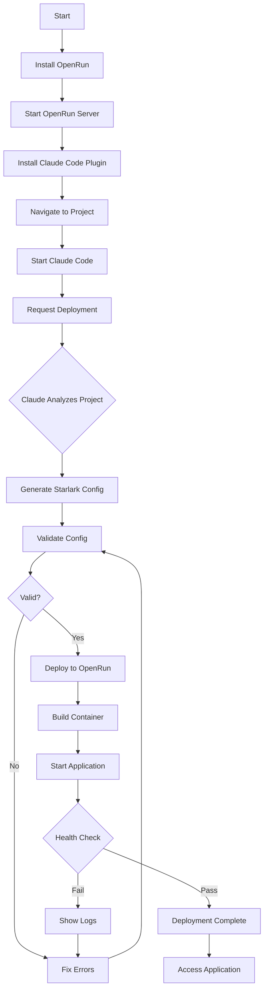

# 🎬 OpenRun Claude Code Plugin - Complete Demo

This guide provides a complete terminal-based demonstration of installing and using the OpenRun Claude Code plugin.

## 📋 Table of Contents

- [Prerequisites](#prerequisites)
- [Installation Demo](#installation-demo)
- [Usage Demos](#usage-demos)
- [Example Deployments](#example-deployments)
- [Advanced Workflows](#advanced-workflows)
- [Troubleshooting Demo](#troubleshooting-demo)

---

## Prerequisites

Before starting, ensure you have:

```bash
# Check system requirements
which git       # Git installed
which curl      # Curl installed
which python3   # Python 3.10+ (for Python examples)
which node      # Node.js 18+ (for Node examples)
```

---

## Installation Demo

### Step 1: Install OpenRun

```bash
# Download and install OpenRun
curl -fsSL https://openrun.dev/install.sh | sh

# Output example:
# ✓ Downloading OpenRun v0.x.x...
# ✓ Installing to /Users/username/clhome/bin/openrun
# ✓ OpenRun installed successfully!
#
# Add OpenRun to your PATH:
#   export PATH="$HOME/clhome/bin:$PATH"

# Add to PATH (add this to ~/.bashrc or ~/.zshrc)
export PATH="$HOME/clhome/bin:$PATH"

# Verify installation
openrun version

# Output:
# openrun v0.x.x
```

### Step 2: Start OpenRun Server

```bash
# Start the OpenRun server
openrun server start

# Output:
# ✓ Starting OpenRun server...
# ✓ Server listening on unix://clhome/run/openrun.sock
# ✓ Web UI available at http://localhost:3000
#
# Server is ready to accept deployments!

# Verify server is running (in another terminal)
openrun app list

# Output:
# No apps deployed yet
```

### Step 3: Install Claude Code

```bash
# Install Claude Code (if not already installed)
# Visit: https://code.claude.com

# Verify installation
claude code --version

# Output:
# Claude Code version 1.x.x
```

### Step 4: Install OpenRun Plugin

```bash
# Method 1: Direct install from GitHub (recommended)
claude code plugin install https://github.com/HyperDevApp/openrun-claude-plugin

# Output:
# ✓ Downloading plugin...
# ✓ Installing to ~/.claude/plugins/openrun-plugin
# ✓ Plugin installed successfully!
#
# Available skill: openrun-deploy

# Method 2: Manual installation
git clone https://github.com/HyperDevApp/openrun-claude-plugin.git
cp -r openrun-claude-plugin ~/.claude/plugins/

# Verify plugin is installed
claude code plugin list

# Output:
# Installed plugins:
# - openrun-plugin (v1.0.0)
#   Skills: openrun-deploy
```

---

## Usage Demos

### Demo 1: Deploy Streamlit Dashboard

```bash
# Clone the plugin repository to access examples
git clone https://github.com/HyperDevApp/openrun-claude-plugin.git
cd openrun-claude-plugin/examples/streamlit-dashboard

# Check what's in the directory
ls -la

# Output:
# app.py
# requirements.txt
# deploy.star
# README.md

# Start Claude Code
claude code

# Terminal session with Claude:
```

**Terminal Output:**
```
┌─────────────────────────────────────────────────┐
│ Claude Code Interactive Session                │
│ Type 'exit' to quit, 'help' for commands       │
└─────────────────────────────────────────────────┘

You: Deploy this directory as a Streamlit app at /dashboard

Claude: I'll help you deploy this Streamlit application. Let me analyze
        the project structure first...

[Claude reads app.py, requirements.txt]

Claude: I found a Streamlit dashboard application. Here's what I'll do:

        1. Verify OpenRun server is running
        2. Generate deployment configuration
        3. Deploy using OpenRun

        Checking OpenRun status...

[Executing: openrun app list]

Claude: ✓ OpenRun server is running

        Generating Starlark configuration...

[Creating: deploy.star]

        Configuration created:
        - Path: /dashboard
        - Spec: python-streamlit
        - Port: 8501
        - Memory: 512MB
        - CPU: 1 core

        Validating configuration...

[Executing: openrun apply --dry-run deploy.star]

Claude: ✓ Configuration is valid

        Deploying application...

[Executing: openrun apply --approve deploy.star]

Output:
✓ Pulling image python:3.11-slim
✓ Building application container
✓ Installing dependencies from requirements.txt
✓ Starting Streamlit server
✓ Application deployed successfully!

Claude: Your Streamlit dashboard is now running!

        Access it at: http://localhost/dashboard

        To view logs:     openrun app logs /dashboard
        To reload app:    openrun app reload /dashboard
        To delete app:    openrun app delete /dashboard
```

### Demo 2: Deploy FastAPI Service

```bash
cd ../fastapi-service

# Start Claude Code
claude code
```

**Terminal Output:**
```
You: Deploy this FastAPI app at /api

Claude: I'll deploy this FastAPI service. Let me check the project...

[Claude reads main.py, requirements.txt]

Claude: Found a FastAPI application with 7 endpoints. Deploying...

[Executing: openrun apply --approve deploy.star]

Output:
✓ Building FastAPI container
✓ Installing fastapi, uvicorn, pydantic
✓ Starting application server
✓ Health check passed
✓ Deployed successfully!

Claude: Your FastAPI service is live at http://localhost/api

        Interactive API docs: http://localhost/api/docs
        Alternative docs:     http://localhost/api/redoc

        Test the API:
        curl http://localhost/api/health

You: Can you test the API?

Claude: Sure! Let me test the health endpoint...

[Executing: curl http://localhost/api/health]

Output:
{
  "status": "healthy",
  "timestamp": "2026-02-13T21:30:00Z",
  "tasks_count": 3
}

Claude: ✓ API is healthy and responding correctly!
```

### Demo 3: Deploy with Custom Parameters

```bash
cd ../streamlit-dashboard

claude code
```

**Terminal Output:**
```
You: Deploy this with 2GB memory and 2 CPU cores for production

Claude: I'll deploy this with production-grade resources...

[Executing: openrun apply --approve --param memory=2g --param cpu=2 deploy.star]

Output:
✓ Applying configuration with custom parameters
  - Memory: 2GB
  - CPU: 2 cores
✓ Container started with enhanced resources
✓ Deployment complete!

Claude: Deployed with production resources at /dashboard
```

---

## Example Deployments

### Complete Workflow: Next.js App

```bash
# Navigate to Next.js example
cd examples/nextjs-webapp

# View the project structure
tree -L 2

# Output:
# .
# ├── app/
# │   ├── page.tsx
# │   ├── layout.tsx
# │   └── globals.css
# ├── package.json
# ├── next.config.js
# ├── deploy.star
# └── README.md

# Start interactive session
claude code
```

**Full Terminal Session:**
```
═══════════════════════════════════════════════════
  Claude Code - OpenRun Deployment Demo
═══════════════════════════════════════════════════

You: I want to deploy this Next.js app. Can you help?

Claude: Absolutely! I see you have a Next.js 14 application with
        TypeScript and Tailwind CSS. Let me prepare the deployment.

        First, I'll check if OpenRun is ready...

        $ openrun version
        openrun v0.9.0

        ✓ OpenRun is installed and ready

        $ openrun app list
        PATH          STATUS    VERSION  UPDATED
        /api          running   v1       2m ago
        /dashboard    running   v1       5m ago

        You have 2 apps currently running.

        Now let me analyze your Next.js project...

        [Reading package.json]
        [Reading next.config.js]
        [Reading app/page.tsx]

        I found:
        • Next.js 14 with App Router
        • TypeScript configuration
        • Tailwind CSS for styling
        • Standalone output mode (optimized for containers)

        This is perfect for OpenRun deployment!

        I'll create a deployment configuration for /webapp.
        The app will be built and deployed in production mode.

        Creating deploy.star...

        $ cat deploy.star
        load("ace.in", "app")

        app(
            path="/webapp",
            source=".",
            spec="node-nextjs",
            container_opts={
                "cpus": "1",
                "memory": "1g",
                "port": "3000"
            },
            env={
                "NODE_ENV": "production"
            }
        )

        ✓ Configuration created

        Ready to deploy. Should I proceed?

You: Yes, deploy it

Claude: Deploying your Next.js application...

        $ openrun apply --approve deploy.star

        ⏳ Building Next.js application...

        > next build
        ✓ Creating optimized production build
        ✓ Generating static pages
        ✓ Compiling TypeScript
        ✓ Finalizing optimization

        Build completed in 45s

        ⏳ Creating container...
        ✓ Copying standalone build
        ✓ Installing production dependencies
        ✓ Configuring Next.js server

        ⏳ Starting application...
        ✓ Server started on port 3000
        ✓ Health check passed

        ━━━━━━━━━━━━━━━━━━━━━━━━━━━━━━━━━━━━━━━━━━━

        🎉 Deployment successful!

        Your Next.js app is now live:

        URL:  http://localhost/webapp
        Path: /webapp
        Status: Running
        Memory: 1GB
        CPU: 1 core

        ━━━━━━━━━━━━━━━━━━━━━━━━━━━━━━━━━━━━━━━━━━━

You: Can you show me all running apps?

Claude: Sure! Let me get the current status...

        $ openrun app list

        PATH          STATUS    VERSION  MEMORY    CPU    UPDATED
        /api          running   v1       256MB     0.5    15m ago
        /dashboard    running   v1       512MB     1.0    18m ago
        /webapp       running   v1       1GB       1.0    just now

        You have 3 applications running successfully!

You: Perfect! How do I check the logs?

Claude: You can view logs with:

        $ openrun app logs /webapp

        Or for real-time logs:

        $ openrun app logs -f /webapp

        Let me show you the recent logs...

        [2026-02-13 21:35:00] ▲ Next.js 14.1.0
        [2026-02-13 21:35:00] - Local:        http://localhost:3000
        [2026-02-13 21:35:00] - Environment:  production
        [2026-02-13 21:35:01] ✓ Ready in 1.2s

        Your app is running smoothly!
```

---

## Advanced Workflows

### Workflow 1: Multi-Environment Deployment

```bash
# Create staging and production deployments
claude code
```

**Terminal Session:**
```
You: I need to deploy this app to both staging and production environments

Claude: I'll help you set up multi-environment deployments.

        Creating parameterized configuration...

        $ cat deploy.star
        load("ace.in", "app")
        load("params.in", "param")

        def main():
            env = param("environment", default="production", type="STRING")
            memory = param("memory", default="1g", type="STRING")

            app(
                path=f"/{env}-webapp",
                source=".",
                spec="node-nextjs",
                container_opts={
                    "memory": memory
                },
                env={
                    "NODE_ENV": env
                }
            )

        ✓ Configuration supports multiple environments

        Deploying to staging:
        $ openrun apply --approve --param environment=staging --param memory=512m deploy.star

        ✓ Staging deployed at /staging-webapp

        Deploying to production:
        $ openrun apply --approve --param environment=production --param memory=2g deploy.star

        ✓ Production deployed at /production-webapp

        Both environments are now running!
```

### Workflow 2: Update Existing Deployment

```bash
# Update the /dashboard app
claude code
```

**Terminal Session:**
```
You: I updated the dashboard code. Can you reload it?

Claude: I'll reload the dashboard app with the latest code...

        $ openrun app reload /dashboard

        ⏳ Reloading /dashboard...
        ✓ Pulling latest code
        ✓ Rebuilding container
        ✓ Starting new version
        ✓ Health check passed
        ✓ Promoted to production

        Your dashboard has been updated successfully!

        Old version: v1 → New version: v2
```

---

## Troubleshooting Demo

### Issue 1: OpenRun Server Not Running

```bash
claude code
```

**Terminal Session:**
```
You: Deploy this app at /myapp

Claude: Let me check OpenRun status...

        $ openrun app list

        Error: Failed to connect to OpenRun server
        Socket connection refused

        ❌ The OpenRun server is not running.

        To fix this, start the server in a new terminal:

        $ openrun server start

        Then try the deployment again.
```

### Issue 2: Port Conflict

```bash
claude code
```

**Terminal Session:**
```
You: Deploy at /api

Claude: Attempting deployment...

        $ openrun apply --approve deploy.star

        Error: Path /api is already in use by another application

        ❌ An app already exists at this path.

        Current apps:
        /api - FastAPI service (running)

        Options:
        1. Update the existing app:
           $ openrun app reload /api

        2. Delete and recreate:
           $ openrun app delete /api
           $ openrun apply --approve deploy.star

        3. Deploy to a different path:
           Change path="/api" to path="/api-v2"

        What would you like to do?
```

### Issue 3: Missing Dependencies

```bash
claude code
```

**Terminal Session:**
```
You: Deploy this Flask app

Claude: Deploying Flask application...

        $ openrun apply --approve deploy.star

        Building container...
        ❌ Build failed

        Error: No requirements.txt found

        Flask apps need a requirements.txt file.
        Let me create one for you...

        $ cat > requirements.txt <<EOF
        flask==3.0.0
        gunicorn==21.2.0
        EOF

        ✓ requirements.txt created

        Retrying deployment...

        $ openrun apply --approve deploy.star

        ✓ Build successful
        ✓ Deployment complete

        Your Flask app is now running at /myapp
```

---

## Quick Reference Commands

### OpenRun Commands

```bash
# Server management
openrun server start              # Start server
openrun server stop               # Stop server
openrun version                   # Check version

# App deployment
openrun apply deploy.star         # Deploy from config
openrun apply --approve deploy.star    # Auto-approve permissions
openrun apply --dry-run deploy.star    # Validate only

# App management
openrun app list                  # List all apps
openrun app list -i              # Include staging apps
openrun app create SOURCE PATH   # Quick deploy
openrun app reload PATH          # Reload source
openrun app delete PATH          # Delete app
openrun app logs PATH            # View logs
openrun app logs -f PATH         # Stream logs
openrun app approve PATH         # Approve permissions
```

### Claude Code Commands

```bash
# Plugin management
claude code plugin list          # List installed plugins
claude code plugin install URL   # Install plugin
claude code plugin remove NAME   # Remove plugin

# Interactive session
claude code                      # Start interactive session
claude code --help              # Show help
```

---

## Visual Workflow Diagram



---

## Next Steps

1. **Try the examples:**
   ```bash
   cd examples/
   ls -la
   ```

2. **Read the documentation:**
   - [QUICKSTART.md](./QUICKSTART.md) - Fast setup guide
   - [INSTALLATION.md](./INSTALLATION.md) - Detailed installation
   - [../README.md](../README.md) - Full documentation

3. **Explore OpenRun:**
   - [OpenRun Documentation](https://openrun.dev/docs/)
   - [Starlark Language Guide](https://starlark-lang.org/)

4. **Get help:**
   - [GitHub Issues](https://github.com/HyperDevApp/openrun-claude-plugin/issues)
   - OpenRun server logs: `openrun server logs`

---

**Happy deploying! 🚀**
